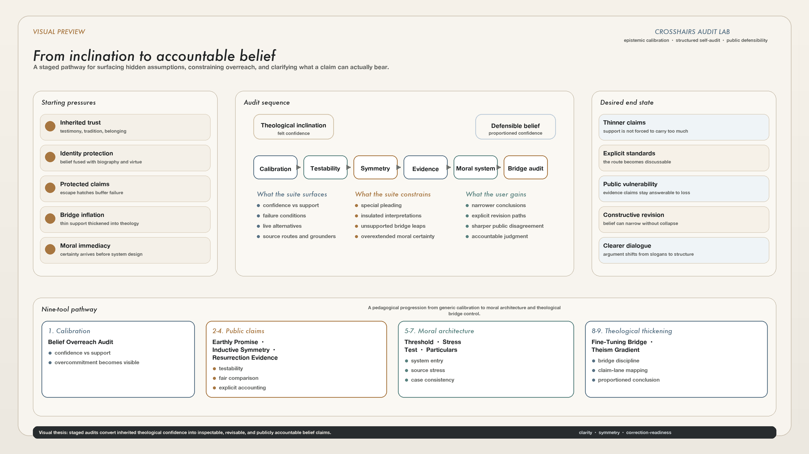
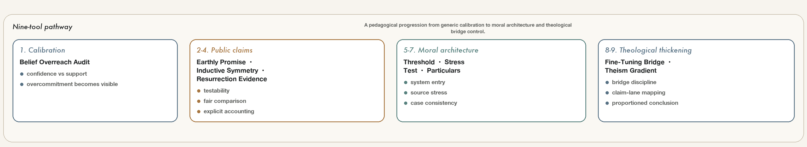

*ORCID:* <https://orcid.org/0009-0009-3725-8682>

::: {.content-visible when-format="pdf"}
\thispagestyle{empty}
\vspace{1.5em}
\noindent\textbf{\Large Visual Preview:}

\vspace{0.3em}

\begin{center}
\makebox[\textwidth][c]{\includegraphics[width=\paperwidth,height=0.72\textheight,keepaspectratio]{assets/visual-preview.png}}
\end{center}
:::

::: {.content-visible unless-format="pdf"}
**Visual Preview:**

{fig-alt="A dense visual preview of the paper's core argument, showing the movement from theological inclination toward defensible belief through staged interactive audits." width=100%}
:::

\newpage

# Abstract {.unnumbered}

This paper introduces Crosshairs Audit Lab, a suite of nine interactive
browser-based tools designed to help theologically inclined inquirers move from
inherited confidence toward clearer, thinner, and more publicly defensible
belief positions. The paper argues that the central problem in much apologetic
reasoning is not simply false belief, but the collapse of several distinctions
that responsible inquiry requires: between confidence and substantiation,
private meaning and public evidence, thin conclusions and the thicker claims
later built upon them, and sincerity and correction-readiness. Framed as a
design-and-pedagogy paper rather than an outcome study, the essay situates the
suite within research on epistemic cognition, motivated reasoning,
disconfirmation in religious belief, and scaffolded conceptual change. It
argues that Crosshairs Audit Lab contributes a staged interactive method for
teaching seekers how to audit their own claims without requiring immediate
worldview abandonment. The suite's pedagogical aim is not to coerce unbelief,
but to make belief answerable to explicit standards, explicit bridge premises,
and explicit conditions of revision.

# Introduction

Inquiry about religion rarely begins from a position of perfect neutrality.
Many people approach theological questions already disposed toward a tradition,
already moved by forms of worship, already shaped by testimony, communal trust,
family inheritance, existential need, or the felt intelligibility of a
religious picture of the world. That starting point is not in itself
intellectually discrediting. All inquiry begins somewhere. The more difficult
question is what happens when inclination is silently converted into thick
public claims: when attraction to a tradition becomes confidence that its
miracles occurred, that its promises are evidentially reliable, that its moral
pronouncements are fully grounded, or that a thin argument for purposive order
licenses much thicker conclusions about divine personality, providence, or
Christian revelation. Much apologetic dispute, on this view, is not best
understood as a simple clash between faith and skepticism. It is better
understood as a disagreement over whether confidence, support, bridge premises,
and correction conditions have been properly distinguished.

This paper argues that a substantial share of apologetic overreach arises when
those distinctions collapse. In many ordinary religious contexts, the language
of "belief" covers too much ground. It can refer at once to existential trust,
personal loyalty, probabilistic confidence, testimonial reliance, historical
judgment, communal identity, and public advocacy. The resulting ambiguity makes
it easy for a claim that is personally meaningful to be presented as publicly
well supported, or for a conclusion that is emotionally central to be granted
more inferential weight than the stated evidence can actually bear. A
defensible belief position, as the term is used here, is therefore not merely a
belief sincerely held. It is a position whose confidence level, evidential
support, inferential bridges, comparison standards, and correction conditions
have been made explicit enough to be publicly assessed.

Crosshairs Audit Lab is a response to that problem. It is a suite of nine
browser-based audits that force users to specify how their reasoning is
structured rather than merely announce what they conclude. Its tools address
calibration, public testability, inductive symmetry, explicit evidential
accounting, moral-system architecture, and the recurrent thickening of thin
theistic inferences into broader Christian claims. The central claim of this
paper is that the suite is best understood not as a verdict machine and not
primarily as a polemical device, but as a pedagogical environment for epistemic
calibration.

The paper makes three connected claims. First, apologetic overreach is often a
structural problem in which confidence, support, and bridge legitimacy are
conflated. Second, interactive audits can operationalize these distinctions more
effectively than abstract admonitions alone because they require users to make
their assumptions explicit. Third, a sequenced suite can help users move toward
thinner but more defensible claims without requiring immediate worldview
abandonment. The argument that follows is therefore a design-and-pedagogy
argument, not yet an effectiveness study.

The literature review locates this project within research on epistemic
cognition, motivated reasoning, religious disconfirmation, and scaffolded
conceptual change. The later sections then explain the suite's design logic, its
place relative to apologetic and philosophy-of-religion methods, and the kinds
of intellectual revision it is meant to cultivate.

# Tool Suite Overview

Crosshairs Audit Lab is organized as a pathway rather than a flat catalog.
Table 1 summarizes the nine tools by the question each one foregrounds. Full
links to each tool, manual, and curriculum PDF appear in the appendix.

| Stage | Tool | Core question |
| --- | --- | --- |
| 1. Calibration | Belief Overreach Audit | Does confidence exceed the support the user can actually articulate? |
| 2. Public testability | Earthly Promise Test Field | Are divine-promise claims open to ordinary failure conditions and controls? |
| 3. Comparative fairness | Inductive Symmetry Audit | Are similar patterns judged symmetrically across favored and rival cases? |
| 4. Evidential accounting | Resurrection Evidence Audit | What priors, likelihoods, dependencies, and alternatives are carrying the conclusion? |
| 5. Moral entry | Moral System Threshold | Is there a complete enough moral system to sustain the truth claim being made? |
| 6. Moral stress | Moral System Stress Test | Does the asserted framework survive pressure on authority, coherence, and support? |
| 7. Moral particulars | Moral Particulars Audit | Are case-level judgments consistent with the grounders the user invokes? |
| 8. Bridge discipline | Fine-Tuning Bridge Audit | Does fine-tuning warrant design, purpose, theism, or something thinner? |
| 9. Claim gradient | Deism-Theism Gradient Audit | How far beyond thin design inferences is the conclusion being thickened? |

# Literature Review

## Epistemic Cognition and Standards of Justification

Research on epistemic cognition provides an important starting point for this
project because it asks how people understand knowledge itself: what counts as a
good reason, how certainty should be handled, how sources are evaluated, and
how claims become warranted rather than merely asserted. Hofer and Pintrich's
classic review argued that beliefs about knowledge and knowing are not
peripheral to learning but deeply implicated in how learners assess claims,
authorities, and evidence [@hoferpintrich1997]. Later work has expanded this
picture by emphasizing that epistemic cognition includes judgments about
standards, sources, aims, and the processes by which claims should be evaluated
[@chinn2011; @sandoval2016]. In other words, inquiry is not shaped only by what
people know. It is shaped by what they take knowledge to be and by what they
implicitly accept as a sufficient route to it.

That framework is especially relevant in apologetic settings, where thick
theological conclusions are often defended before the standards governing them
have been made explicit. A person may claim to "know" that prayer works, that a
historical miracle occurred, or that moral objectivity requires Christianity,
while operating with partly hidden assumptions about testimony, probability,
authority, analogy, or moral explanation. The problem is not merely that such
assumptions may be mistaken. It is that they often remain pedagogically
unarticulated. As a result, disagreements about religious belief are frequently
conducted one level too high, with disputants contesting conclusions before
they have identified the standards and inferential norms doing the hidden work.
Crosshairs Audit Lab is built around the claim that a more honest inquiry
environment can be created by forcing those norms into the open and by teaching
users to separate confidence from the justificatory architecture beneath it.

## Motivated Reasoning, Overconfidence, and Identity Protection

If epistemic cognition explains part of the structure of inquiry, research on
motivated reasoning helps explain why that structure is so often distorted.
Kunda's influential account argued that reasoning is frequently guided not only
by accuracy goals but by directional goals that shape which evidence is noticed,
which standards are applied, and which conclusions feel acceptable
[@kunda1990]. Studies of overconfidence similarly show that subjective certainty
regularly exceeds actual warrant or performance, especially when people are
asked to make judgments under uncertainty [@moorehealy2008]. Mercier and
Sperber's argumentative theory adds another layer: much human reasoning appears
better suited to defending positions, evaluating arguments in social contexts,
and stabilizing commitments than to solitary truth-tracking in a pristine sense
[@merciersperber2011]. In identity-laden domains, these tendencies do not
disappear when people become more intelligent or more numerate. Kahan and
colleagues showed that greater quantitative sophistication can coexist with, and
even amplify, identity-protective interpretation when conclusions threaten group
belonging or prior commitments [@kahan2017].

Religious apologetics is a natural setting for these dynamics. Doctrinal and
experiential claims are rarely processed as isolated propositions; they are
entangled with biography, community, moral aspiration, and narratives of self.
Under such conditions, argument often serves a double function. It can be a
genuine attempt at truth-seeking, but it can also become a way of preserving a
meaning-laden identity by rationally dressing what has already been
psychologically settled. That does not entail that religious conclusions are
therefore false. It does imply that any method intended to improve inquiry must
take motivational and identity-protective pressures seriously. One contribution
of the Crosshairs approach is to design around them rather than pretend they are
absent. By externalizing hidden assumptions, using comparison cases, and asking
users to state what would count against a favored claim, the tools attempt to
interrupt the smooth conversion of desire into apparent warrant.

## Religious Inquiry, Disconfirmation, and Quest

The psychology of religion adds a more domain-specific account of what happens
when religious belief encounters counterevidence. Festinger's theory of
cognitive dissonance remains foundational here because it explains why strongly
held commitments may provoke rationalization rather than revision when they are
threatened [@festinger1957]. Batson's experimental work applied this insight to
religious belief more directly, showing that disconfirming information does not
automatically generate neutral reassessment; it can instead elicit processes of
rationalization aimed at preserving the stated belief [@batson1975]. Research on
selective exposure among fundamentalist Christians likewise suggests that
religious orientation can shape whether dissonant material is avoided,
discounted, or engaged under conditions already tilted in favor of preservation
[@mcfarlandwarren1992].

At the same time, the literature on religion as quest complicates any simple
picture in which religiosity is equated with dogmatic closure. Batson and
Schoenrade argued that one recognizable religious orientation values openness,
self-critique, and the tentative pursuit of truth rather than premature
closure [@batsonschoenrade1991]. That strand of research matters for the
present project because Crosshairs is not written only for skeptics arguing
against Christians. It is also written for religious inquirers who wish to
retain honesty under pressure. The suite presumes that there are users who do
not want their beliefs protected at any cost, but who nevertheless need
structures robust enough to help them separate existential commitment from
publicly defensible argument. In this sense, the project attempts to provide a
practical method for a quest-like posture without romanticizing openness as if
it were costless. Openness becomes pedagogically real only when the inquiry
environment specifies what counts as support, what counts as failure, and what
revision would look like.

## Scaffolding, Conceptual Change, and Sequenced Pedagogy

The educational literature helps explain why such specification must be staged.
Wood, Bruner, and Ross's account of scaffolding showed how complex reasoning can
be made possible when tasks are structured so that learners can perform beyond
their unaided level of organization [@wood1976]. In the conceptual change
tradition, Posner and colleagues argued that significant belief revision often
requires dissatisfaction with prior conceptions together with the availability
of alternatives that are intelligible, plausible, and fruitful [@posner1982].
Later work complicated the original, relatively "cold" picture by insisting
that conceptual change is not governed by cognition alone. Motivation,
classroom climate, goals, and identity-relevant concerns shape whether learners
will even entertain revision in the first place [@pintrich1993].

These insights are especially pertinent for theological inquiry. A direct attack
on a person's highest-order worldview commitments may generate rhetorical
resistance long before it generates careful thought. If the pedagogical
environment makes revision feel like total self-loss, then even strong arguments
may never receive a fair hearing. Crosshairs addresses this challenge by
distributing revisionary pressure across a sequence of narrower tasks. The user
is not asked first whether Christianity is false. The user is asked whether
confidence matches support, whether a promise claim names a failure condition,
whether the same inductive pattern would be tolerated in a rival case, whether a
moral claim has a complete grounding structure, or whether a thin design
inference really bears the theological weight later placed upon it. This
sequencing reflects a scaffolding judgment: people often need smaller,
explicitly bounded acts of epistemic honesty before they can undertake larger
acts of worldview revision.

## The Gap Addressed by Interactive Religious Audits

Taken together, these literatures diagnose the problem space with considerable
force. Research on epistemic cognition explains why standards of knowing matter.
Work on motivated reasoning and overconfidence shows why those standards are so
easily bent in identity-laden domains. The psychology of religion shows that
disconfirmation often triggers rationalization and selective exposure, even
while some forms of religiosity remain open to a more self-critical mode.
Educational theory shows that durable revision is scaffolded, affectively
loaded, and context-sensitive rather than purely inferential. What remains
underdeveloped is a practical, integrated, and sequenced intervention that
translates these insights into a toolset for real-time religious self-audit.

Much existing apologetic pedagogy still proceeds either by doctrinal defense or
by essayistic critique. Both genres can be valuable, but neither reliably
requires users to make their weights, thresholds, and bridge assumptions
explicit. Crosshairs Audit Lab proposes a different model: a suite of
interactive audits that transform disputed religious reasoning into visible,
revisable, and comparatively testable structures. Its novelty lies less in the
claim that religious reasoning is biased or difficult; that is already well
documented. Its novelty lies in operationalizing a route by which a
theologically inclined seeker can move from confidence to defensibility through
staged acts of clarification, symmetry-checking, evidential accounting, and
moral-system inspection.

## Positioning Within Philosophy of Religion and Apologetics

This project also needs to be located relative to better-known methods in
philosophy of religion and apologetics. First, Crosshairs is not a simple
rejection of reformed epistemology or experiential models of warrant. Plantinga's
account of warranted Christian belief and Alston's defense of religious
experience both make room for religious belief that is not reducible to public
argument in the narrow evidentialist sense [@plantinga2000; @alston1991].
Crosshairs does not attempt to settle whether such internal warrant exists. It
addresses a narrower and more public problem: what happens when confidence rooted
in devotion, practice, or experience is advanced as historical evidence,
comparative argument, or publicly persuasive apologetic conclusion.

Second, the suite differs from cumulative-case apologetics less by rejecting all
probabilistic reasoning than by auditing how probability arguments are extended.
Swinburne's work is exemplary here because it makes theistic and resurrection
claims explicit in terms of explanatory scope, prior probability, and cumulative
support [@swinburne2004; @swinburne2003]. Crosshairs shares that demand for
explicit accounting, but adds two further constraints: bridge-premise visibility
and comparative symmetry across rival cases. A claim may still survive those
constraints. The point is that the route by which it survives must become
inspectable.

Crosshairs should therefore be read as a meta-pedagogical intervention rather
than as one more first-order apologetic case. It neither replaces substantive
philosophy of religion nor offers a freestanding skeptical proof. Instead, it
audits the movement from theological inclination to publicly defensible claim,
asking when that movement is proportioned, when it becomes overextended, and
which intermediate assumptions are doing the hidden work.

# Design Logic of Crosshairs Audit Lab

## Calibration Before Conclusion

The suite begins from a simple pedagogical conviction: many disputes about
religion are fruitless because the participants have not first learned to
distinguish confidence from support in a general form. The early tools
therefore do not immediately force users into the deepest regions of doctrinal
self-exposure. They begin with comparatively low-threat tasks in which the
central pattern can be seen without requiring an immediate stance on the truth
of Christianity. This reflects a transfer strategy. If users can recognize
overcommitment in gambling, investment, medicine, or personal decision-making,
they are better positioned to recognize structurally similar overreach in
religious settings. The pedagogical wager is that insight travels better when
the first lesson is about reasoning form rather than ideological target.

This design principle also imposes discipline on the suite itself. A tool should
not pretend to settle a higher-order theological question when it is only
teaching a lower-order epistemic distinction. Crosshairs therefore tries to
stage its claims carefully. A finding that confidence exceeds support does not
by itself show that the conclusion is false. A finding that a claim has no clean
failure condition does not by itself show that the claim can never be true. What
such findings do show is that the user's current route to public defensibility
is under strain. The aim is to regulate the relationship between claim-strength
and support-strength, not to infer more than the audit can justify.

## Externalization of Hidden Structure

A second design principle is externalization. Religious reasoning often appears
stronger than it is because many of its most important components remain tacit.
This includes prior probabilities, analogical expectations, assumptions about
testimony, notions of divine intention, standards for miracle claims, escape
hatches for failed promises, and background moral intuitions. When these
components remain implicit, a conclusion can feel well grounded because the user
is unconsciously supplying all missing pieces in a favorable direction. An
interactive audit counters this by forcing the user to make choices, assign
weights, state thresholds, and expose which assumptions are performing the work.

This externalizing function is central to why the project uses tools rather than
essays alone. An essay can warn readers not to special-plead or overgeneralize,
but it often leaves them free to imagine that the warning applies elsewhere. A
tool is less permissive. It requires a user to locate the claim, define the
comparison, choose the bridge, indicate the control, or specify the correction
condition. The output then becomes discussable precisely because the hidden
structure has been surfaced. In this sense, Crosshairs is not just an argument
against bad reasoning. It is an interface for making reasoning inspectable.

## Symmetry as an Anti-Special-Pleading Norm

A third principle is symmetry. Apologetic reasoning is especially vulnerable to
asymmetric treatment of evidence because favored conclusions are often granted
interpretive charity that rival conclusions are denied. The same testimonial
pattern may be treated as compelling in one setting and laughable in another.
The same appeal to cumulative case reasoning may be welcomed when it points
toward Christianity and rejected when it supports a rival religion. The same
level of ambiguity may be tolerated when it preserves a preferred belief and
condemned when it threatens it. Crosshairs therefore repeatedly inserts
comparison cases and lane-based mappings that ask not merely, "Is this claim
supported?" but also, "Would this standard still look acceptable if the
emotional direction changed?"

This symmetry norm does not assume that all religions, miracles, or moral
systems are equal. It assumes something more modest and more methodologically
important: that public reasoning should be capable of surviving role reversal.
If a justification works only when one conclusion is emotionally privileged,
then the user has learned something important about the method's instability.
Several tools in the suite use this norm as a structural hinge because symmetry
checks often reveal hidden double standards more efficiently than direct debate
over a single favored case.

## Public Vulnerability to Correction

Another governing principle is that claims offered as public evidence should
remain publicly vulnerable to loss. Religious belief often includes elements of
private interpretation, existential meaning, devotion, and communal identity.
The suite does not deny that those elements matter. It does insist, however,
that once a claim is advanced as publicly relevant evidence, it incurs burdens
that private meaning alone cannot discharge. A promise claim, miracle claim, or
historical inference must therefore clarify what would count against it and
whether the user is genuinely willing to let such outcomes matter. When the
claim is padded with enough post hoc qualifications to survive any failure, its
status has shifted from evidence-bearing assertion toward insulated
interpretation.

This principle is especially important because many apologetic disputes are not
about whether a believer may find a claim meaningful. They are about whether the
claim is being advertised as evidence while simultaneously protected from the
ordinary consequences of evidential defeat. Crosshairs tries to keep those
categories separate. The point is not to ban all nonpublic belief. The point is
to stop private resilience from masquerading as public substantiation.

## Moral Architecture Before Moral Certainty

The morality pathway adds a further design thesis: strong moral conclusions
often arrive before the user has articulated a complete moral system. Religious
apologetics frequently appeals to moral outrage, moral intuition, or moral
realism as though these immediately support a Christian framework. Yet moral
judgment depends on more than bare conviction. It requires some account of truth
makers, authority, access, consistency, adjudication, and application across
cases. If these structural elements are missing or unstable, then the user's
moral certainty may outrun the system that is supposed to underwrite it. The
morality tools therefore refuse to treat isolated moral confidence as enough.
They ask first whether a moral architecture exists, then whether it survives
stress, and then whether it behaves consistently across concrete particulars.

This sequence matters because moral argument often functions as a high-leverage
entry point in apologetics. If the architecture beneath it is underspecified,
then the debate is being conducted at the wrong level. The relevant question is
not merely whether a given act seems right or wrong. It is whether the claimed
source of moral truth can carry the weight later placed upon it.

## Thin Conclusions and the Problem of Theological Thickening

The final design principle concerns inferential thickening. Even when a religious
argument yields some limited support, that support is often silently expanded
into a much stronger conclusion. A weakly purposive universe becomes a personal
designer. A designer becomes a morally concerned deity. A deity becomes the God
of Christian scripture. A historically interesting set of resurrection claims
becomes assurance of the entire doctrinal package. Crosshairs attempts to slow
this slide by auditing the bridges between layers of conclusion. It treats the
question "Does this support some purposive inference?" as distinct from "Does
this support Christian theism?" and again distinct from "Does this support the
full practical confidence often attached to Christian claims?"

This anti-thickening discipline is central to the phrase "defensible belief" in
the paper's title. A belief becomes more defensible not only when it becomes
more supported, but also when it becomes more proportioned. Sometimes the most
intellectually responsible outcome is not disbelief simpliciter, but a thinner
claim, a narrower conclusion, a lowered confidence rating, or a more candid
partition between private meaning and public evidence.

# The Pedagogical Pathway Across the Nine Tools

{#fig-pathway-schematic width=100%}

## Stage One: Belief Overreach Audit

The suite opens with the Belief Overreach Audit because it teaches the grammar
of the entire project. Users are introduced to the possibility that confidence
can outstrip what they themselves take the support to be, and that such
overreach is not a merely verbal mistake but one with practical consequences.
This first stage matters because later theological disagreements often remain
stuck until participants see that the issue is not only what they believe, but
how far beyond available support they are willing to extend that belief. By
placing this lesson in a broader decision-theoretic setting, the tool lowers
identity threat while preserving conceptual sharpness.

## Stage Two: Earthly Promise Test Field

Once users can distinguish confidence from support at a general level, the next
question is whether ordinary religious claims remain genuinely open to worldly
verification. The Earthly Promise Test Field is pedagogically important because
it deals with claims that are often existentially vivid but conceptually loose:
prayer outcomes, healing, protection, guidance, wisdom, and similar promises.
The tool asks whether these claims specify what success and failure would look
like, whether ordinary controls are accepted, and whether excuse structures
protect the claim from clean loss. This stage teaches that a claim may feel
deeply real while still being methodologically insulated.

## Stage Three: Inductive Symmetry Audit

The symmetry audit shifts attention from isolated claims to comparative
reasoning. Its value is pedagogical as much as diagnostic. Once users must
compare parallel patterns across favored and disfavored cases, special pleading
becomes harder to sustain as a tacit habit. The tool therefore serves as a
mid-sequence bridge between local claim inspection and higher-order worldview
discipline. It helps users see that the real issue is often not simply whether
one case has weaknesses, but whether standards remain stable when the conclusion
becomes threatening.

## Stage Four: Resurrection Evidence Audit

The resurrection tool occupies a different place in the sequence because it
forces explicit accounting. Here the user is asked to name priors, estimate
likelihoods, weigh dependence, and consider alternatives. The pedagogical point
is not that ordinary believers should become professional Bayesians. It is that
miracle claims should not receive immunity from the demand that inferential
structure be made visible. By converting a rhetorically powerful topic into a
transparent evidential map, the tool teaches a lesson likely to generalize: the
strength of a religious conclusion depends not only on the emotional resonance
of the claim but on the explicit structure of the route by which it is reached.

## Stage Five: Moral System Threshold, Stress Test, and Particulars Audit

The morality pathway is deliberately sequenced internally. Moral System
Threshold asks whether the user has even specified enough of a moral framework
to support strong truth claims. Moral System Stress Test then examines how that
framework behaves under pressure, including questions of authority, consistency,
substantiation, and source reliance. Moral Particulars Audit finally descends
into concrete cases, where many apparently strong systems reveal either
selective application or concentrated dependence on only a few unstable
grounders. Taken together, these tools embody the paper's claim that moral
certainty should not outrun moral architecture.

## Stage Six: Fine-Tuning Bridge Audit and Deism-Theism Gradient Audit

The final pair addresses apologetic thickening directly. Fine-Tuning Bridge
Audit asks whether the move from cosmic fine-tuning to design, life-purpose,
human-purpose, or theism is doing more work than the starting point can
reasonably support. Deism-Theism Gradient Audit then widens the frame by mapping
how users distribute confidence across a spectrum from minimal purposive order
to thick Christian claims. Pedagogically, these tools function as culmination
devices. They assume that the user has already encountered calibration,
testability, symmetry, explicit accounting, and moral architecture. The aim is
to bring those lessons to bear on the recurrent apologetic habit of sliding from
thin support to thick theology without pausing to inspect each bridge.

## Why the Order Matters

The suite is therefore not merely a catalog of thematically related resources.
Its order is part of its argument. It moves from comparatively low-threat
calibration to increasingly identity-relevant domains; from generic reasoning
form to explicitly theological content; from public testability to historical
claims, then to moral structure, then to metaphysical thickening. This ordering
reflects both motivational and conceptual judgments. Motivationally, early
success at smaller acts of epistemic honesty lowers the threat of later revision
[@pintrich1993]. Conceptually, later tools depend on distinctions introduced
earlier, especially the differences between confidence and support, between
insulated meaning and public evidence, and between thin and thick conclusions.

## Illustrative User Path

Consider a hypothetical user who begins with high confidence that ordinary
answered-prayer stories provide strong public evidence for Christianity. In the
Belief Overreach Audit, that user may discover that the confidence assigned to
the conclusion significantly exceeds the support the user can actually describe.
The tool does not yet force a theological verdict, but it does force a first
separation between how certain the claim feels and how much explicit support the
user can name for it.

The same user then enters the Earthly Promise Test Field and discovers that the
claim "God answers prayer in publicly visible ways" has not been paired with a
clear failure condition. Once controls, counter-cases, and excuse structures are
made visible, the claim may need to narrow: perhaps from a public generalization
about divine intervention to a more modest statement about private devotional
meaning or selectively interpreted experience. At that point the user's belief
need not disappear, but its public evidential role changes.

If the user next enters the Inductive Symmetry Audit, the question becomes
comparative rather than merely introspective: would equally vivid prayer
testimony from another tradition be treated with the same generosity? If not,
then the issue is no longer only insufficient specification but methodological
asymmetry. Across these three tools, the likely outcome is not "Christianity is
therefore false." The more characteristic outcome is that a thick public claim
is thinned into a narrower, more accountable, and more honestly described
position. That is precisely the kind of revision the suite is designed to
cultivate.

# Discussion

## A Constructive Rather Than Merely Debunking Project

One of the paper's most important clarifications is that Crosshairs should not
be framed as a machine for humiliating believers. The strongest intellectual
version of the project is constructive. It allows a religious inquirer to prune
overclaiming, narrow unsupported assertions, isolate where a bridge premise is
doing illicit work, and decide which claims belong in the domain of personal
meaning rather than public argument. If the suite succeeds, one possible
outcome is disbelief; another is chastened but still religious commitment; and a
third is a more explicit partition between devotional trust and evidentially
defensible conclusion. The point is not predetermined deconversion. The point is
the production of clearer and more proportioned doxastic states.

This constructive framing also answers a predictable objection. Critics may say
that any audit designed around public defensibility already privileges a
skeptical epistemology. There is truth in the complaint if it is taken to mean
that the suite demands explicit standards, symmetry, and correction-readiness.
Those are indeed nonneutral demands. But they are also the demands ordinarily
incurred once a belief is offered as public evidence. Crosshairs does not insist
that all valuable beliefs be public in this sense. It insists only that when
private meaning is converted into public proof, the conversion must be audited.

## Why Interactivity Matters

The argument of the paper is not merely that the underlying epistemic norms are
good norms. It is that the medium of instruction matters. Interactivity changes
the pedagogical situation because it shifts users from passive agreement or
disagreement into constrained self-specification. Instead of nodding along with
the claim that miracle reasoning should consider alternatives, the user must
actually indicate which alternatives remain live. Instead of affirming that
moral truth needs grounding, the user must indicate which grounders are doing
the work. Instead of declaring that prayer is evidentially meaningful, the user
must clarify whether any result could count against the claim.

That interface logic may help explain why the suite has promise as a pedagogical
instrument. Research on epistemic cognition and conceptual change suggests that
learning improves when standards are made explicit and when the learner is
confronted with structured dissatisfaction rather than with only abstract
counterassertion [@chinn2011; @posner1982]. Crosshairs attempts to operationalize
that insight in a religious domain by making hidden assumptions difficult to
preserve in their tacit form.

## Relevance for Religious Pedagogy and Public Dialogue

The paper also suggests a broader application beyond apologetics narrowly
construed. The suite could be used in philosophy of religion courses, adult
religious education, skeptical discussion groups, or inter-worldview dialogue
contexts where the aim is not simply to win a debate but to clarify what is
actually being claimed and what supports it. In that respect, the project may
have value even where participants reach different substantive conclusions. A
Christian, agnostic, and atheist may disagree sharply at the end of the process,
yet still benefit from having made their standards, bridges, and failure
conditions more explicit.

This use case is worth emphasizing because public religious argument often
suffers from category mistakes. A critic attacks existential trust as though it
were a historical claim; a believer defends a public miracle claim with the
language of private meaning; a moral intuition is advanced as though it were
already a full metaethical account. By disaggregating these layers, the suite
may improve the quality of disagreement even when it does not eliminate it.

# Limitations and Future Work

The paper's present claims are architectural and pedagogical, not yet
experimental. That limitation is important. Crosshairs may be well designed and
still prove less effective than hoped. Future research should therefore examine
whether users who complete the suite show measurable changes in calibration,
symmetry of judgment, willingness to specify correction conditions, or readiness
to thin overextended conclusions. Comparative studies would be especially useful:
for example, comparing interactive audit exposure with essay-based instruction on
the same epistemic norms.

Another limitation is normative. The suite clearly privileges explicitness,
public vulnerability, and inferential discipline. Many religious practitioners
will regard those demands as too narrow for lived faith. That criticism should
not be evaded. Instead, it should be answered by clarifying the domain of the
project. Crosshairs is designed primarily for claims functioning as arguments,
evidence, or public justification. It is not a total theory of religion, and it
does not pretend to exhaust the value of ritual, devotion, belonging, or
existential orientation.

There is also a measurement issue. Because the tools rely on user inputs, they
cannot escape the quality of the assumptions supplied. Yet this is not simply a
defect. It is part of the design. The goal is not to replace judgment with
automation, but to force judgment into visible form so that it can be inspected,
contested, and revised. Future versions of the paper could strengthen this point
by distinguishing more carefully between score objectivity and procedural
transparency.

Finally, the current paper remains strongly centered on Christian apologetic
contexts. That focus is appropriate to the present tool suite, but future work
could ask whether the same pedagogical framework transfers to other religious
traditions or to secular ideological systems where identity protection,
evidential asymmetry, and inferential thickening also play important roles.

# Conclusion

Crosshairs Audit Lab is offered as a response to a specific problem: theological
inclination often matures into thick public confidence without passing through
enough stages of clarification, comparison, and correction. The suite's
intervention is neither to forbid religious commitment nor to guarantee
skeptical outcomes. Its intervention is to make public-facing belief claims more
answerable to explicit standards, visible bridge premises, and real conditions
of revision.

The paper's contribution is therefore methodological and pedagogical. It draws
on research in epistemic cognition, motivated reasoning, religious
disconfirmation, and scaffolded conceptual change, but translates those
literatures into a sequenced audit environment for religious inquiry. If the
suite succeeds, the most characteristic result will not be rhetorical victory.
It will be a more proportioned doxastic state: narrower where support is thin,
clearer where assumptions were hidden, and more accountable wherever a claim is
offered as public evidence.

::: {.content-visible when-format="pdf"}
\appendix
:::

# Appendix: Tool Resource Guide

For print readers, the live hub remains the most reliable single access point
for the current tool pages and companion PDFs:

{fig-alt="QR code linking to the Crosshairs Audit Lab hub at xhairs.com." width=22%}

Hub URL: <https://xhairs.com/>

Print-friendly tool URLs:

| Tool | URL |
| --- | --- |
| Belief Overreach Audit | `xhairs.com/apps/belief-overreach-audit/` |
| Fine-Tuning Bridge Audit | `xhairs.com/apps/fine-tuning-bridge-audit/` |
| Earthly Promise Test Field | `xhairs.com/apps/falsifiability-field/` |
| Inductive Symmetry Audit | `xhairs.com/apps/inductive-symmetry-audit/` |
| Resurrection Evidence Audit | `xhairs.com/apps/resurrection-evidence-audit/` |
| Moral System Threshold | `xhairs.com/apps/moral-system-threshold/` |
| Moral System Stress Test | `xhairs.com/apps/moral-system-stress-test/` |
| Moral Particulars Audit | `xhairs.com/apps/moral-particulars-audit/` |
| Deism-Theism Gradient Audit | `xhairs.com/apps/theism-gradient-audit/app.html` |

\newpage

Digital resource inventory:

::: {.content-visible when-format="pdf"}
\begingroup
\small
\setlength{\parskip}{0.15em}
:::

1. [Belief Overreach Audit](https://xhairs.com/apps/belief-overreach-audit/) — calibrates the gap between confidence and perceived support.\
   — [Manual](https://xhairs.com/assets/manuals/belief-overreach-audit-manual-v2.pdf)\
   — [Curriculum](https://xhairs.com/assets/manuals/belief-overreach-audit-curriculum.pdf)

2. [Fine-Tuning Bridge Audit](https://xhairs.com/apps/fine-tuning-bridge-audit/) — checks whether fine-tuning really licenses design, purpose, or theism.\
   — [Manual](https://xhairs.com/assets/manuals/fine-tuning-bridge-audit-manual.pdf)\
   — [Curriculum](https://xhairs.com/assets/curricula/fine-tuning-bridge-audit-curriculum.pdf)

3. [Earthly Promise Test Field](https://xhairs.com/apps/falsifiability-field/) — tests whether earthly divine-promise claims remain open to ordinary verification.\
   — [Manual](https://xhairs.com/output/pdf/earthly-promise-test-field-manual.pdf)\
   — [Curriculum](https://xhairs.com/output/pdf/earthly-promise-test-field-curriculum.pdf)

4. [Inductive Symmetry Audit](https://xhairs.com/apps/inductive-symmetry-audit/) — compares whether similar patterns are judged fairly across favored and unfavored cases.\
   — [Manual](https://xhairs.com/assets/manuals/inductive-symmetry-audit-manual.pdf)\
   — [Curriculum](https://xhairs.com/assets/manuals/inductive-symmetry-audit-curriculum.pdf)

5. [Resurrection Evidence Audit](https://xhairs.com/apps/resurrection-evidence-audit/) — makes miracle and resurrection reasoning explicit through structured evidential accounting.\
   — [Manual](https://xhairs.com/assets/manuals/resurrection-evidence-audit-manual.pdf)\
   — [Curriculum](https://xhairs.com/assets/manuals/resurrection-evidence-audit-curriculum.pdf)

6. [Moral System Threshold](https://xhairs.com/apps/moral-system-threshold/) — asks whether a full enough moral system exists to support strong truth claims.\
   — [Manual](https://xhairs.com/assets/manuals/moral-system-threshold-manual-v2.pdf)\
   — [Curriculum](https://xhairs.com/assets/curricula/moral-system-threshold-curriculum-v2.pdf)

7. [Moral System Stress Test](https://xhairs.com/apps/moral-system-stress-test/) — pressure-tests the user's moral framework for authority, consistency, and substantiation.\
   — [Manual](https://xhairs.com/output/pdf/moral-system-stress-test-manual.pdf)\
   — [Curriculum](https://xhairs.com/output/pdf/moral-system-stress-test-curriculum.pdf)

8. [Moral Particulars Audit](https://xhairs.com/apps/moral-particulars-audit/) — checks whether concrete moral judgments remain consistent across cases and grounders.\
   — [Manual](https://xhairs.com/assets/manuals/moral-particulars-audit-manual-v2.pdf)\
   — [Curriculum](https://xhairs.com/assets/curricula/moral-particulars-audit-curriculum.pdf)

9. [Deism-Theism Gradient Audit](https://xhairs.com/apps/theism-gradient-audit/app.html) — maps how thin design inferences are thickened into broader theistic and Christian claims.\
   — [Manual](https://xhairs.com/apps/theism-gradient-audit/docs/deism-theism-gradient-audit-manual.pdf)\
   — [Curriculum](https://xhairs.com/apps/theism-gradient-audit/docs/deism-theism-gradient-audit-curriculum.pdf)

::: {.content-visible when-format="pdf"}
\endgroup
:::

\newpage

# References {.unnumbered}

::: {#refs}
:::
